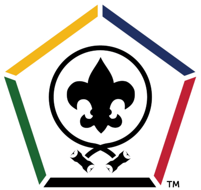
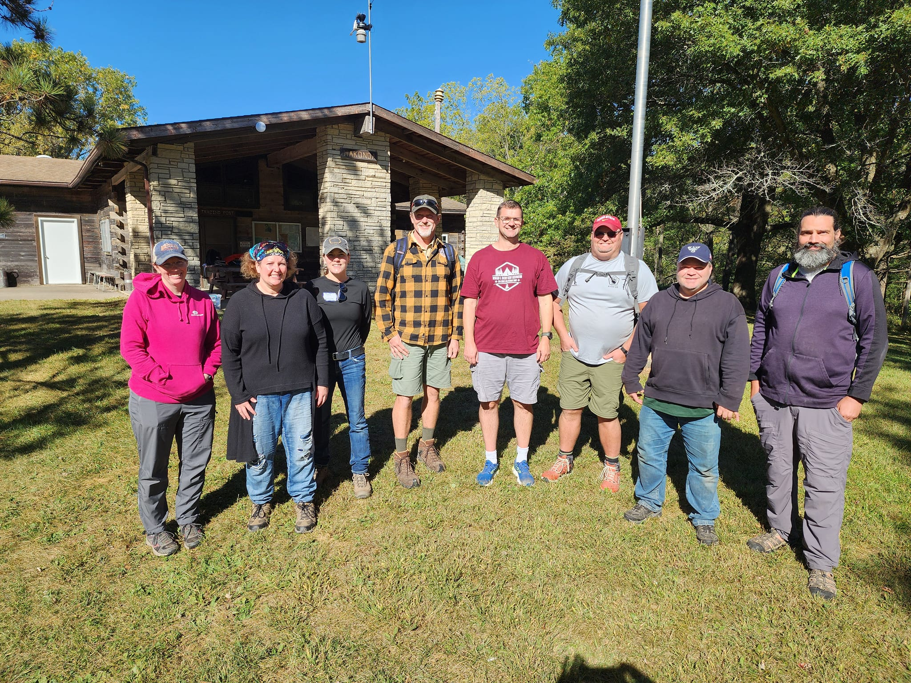

  

# Wood Badge Ticket for Kent Wedeking

### Personal Information
Kent Wedeking  
Course C4-172-23  
kent.wedeking@gmail.com  
319.350.9677  
Cub Scout Den Leader, Pack 55  

### My Personal Vision of Success
To use my experiences and skills to provide meaningful experience for our park, now and in the future.

### Ticket Counselor
Paula Gunter  
319.329.4538  
psgunter@netins.net  

### Course Director
Kevin Kropf  
kkropf42@yahoo.com  

### Timeline
You have 18 months to work your ticket. If you have a question or concern about any part of your ticket, please contact your Ticket Counselor as soon as possible to discuss the issue.  
Your ticket completion deadline is 8 April 2025.  
All timelines are assumed to be days/weeks/months from 9 October 2023.  

## Ticket Goal #1
To create a program where each Arrow of Light (AOL) den member builds and decorates an AOL Career arrow, representing his/her time in the Pack.
### S (Specific)
Each Scout will build a Career arrow which indicates time spent in Cub Scouts and Adventures and Awards received during that time.  This arrow will be a tangible and visible reminder of their Bridging to Scouts BSA and their accomplishments as a Cub Scout.
### M (Measureable)
Goal will be complete when one (1) Webelos 2/AOL den has completed their arrows prior to their AOL Bridging Ceremony.  
Target is for Scouts completing AOL at Blue and Gold Banquet 2024
### A (Attainable)
Will work with Subject Matter Experts at our charter organization, the Waltonian Archers of Linn County, for assistance with arrow construction.  Will decorate and seal arrows as a den during meetings prior to arrow assembly.
### R (Relevant)
This project will provide the Scouts with a tangible reminder of their time in the Pack.  It will also be unique to our Pack, and will provide and incentive for younger scouts to stay in Cub Scouts, and entice other potential members to join the Pack.
### T (Timely)
Proposed Goal Schedule:  
1. Contact Charter Org within 4 weeks.  
1. Create sample arrow within 6 months.  
1. Acquire materials to build 25 arrows within 8 months.  
1. Rollout project to Webelos 2/AOL Den in 11 months.  
1. Arrows complete within 15 months.

- Does this Goal promote Diversity?  No
- Does this Goal promote membership growth and retention? Yes
- Does this Goal show line of sight to the Youth?  Yes

### Progress Update
- Changed Packs from 27 to 55 in December 2023.
- Decided to accelerate timeline to complete Career Arrows for Blue & Gold Banquet for 2024 (12 months ahead of schedule).
- Ordered kits from ArrowAwardKits.com [here](https://www.awardarrowkits.com/arrow-of-light-cub-scout-kit-p-1.html).
    - Ordered Qty 6 Arrow Kits for the 4 Webelo 2's, with two extras for demonstration.
- Current Webelos 2 scouts built arrows in January and Feburary 2024.
    - Instructions were good enough to build on one without outside support.
- Displayed arrows at Blue & Gold Banquet/Bridging Ceremony on 18 Feb 2024 with pack and members of Troop 55.  

- Goal complete 18 February 2024

Ticket Counselor Approval:  
Date:  

## Ticket Goal #2
User the Career Arrows made by Webelo 2's in Goal #1 in their Blue & Gold Banquet.
### S (Specific)
Troop 55, the "parent" or "partner" Troop to Pack 55 takes care of the Bridging Ceremony for new Scouts briding into the Troop at the Blue & Gold Banquets.  
As they have an existing ceremony, we want to integrate the Career Arrows into the Ceremony.  
The Scouts will have the opportunity to share what their Career Arrows are, and what they represent.
### M (Measureable)
Goal will be complete when one (1) Webelos 2/AOL den to complete this Bridging Ceremony.
### A (Attainable)
I will work with the Scoutmaster and Senior Patrol Leader of the Troop to recognize the Scouts by presenting their Career Arrows to them during the ceremony.  
I will describe the purpose and history behind the Career Arrow, and allow the Scouts to display their Arrows to the Scouts, Family, and Friends present.  
I will also open up for the gathered group to ask any questions about the arrows to myself and to the scouts.
### R (Relevant)
My Cub Scout Pack did something similar to this when I bridged to Scouts BSA, and I still have my arrow today.  It hung in my room for many years.  
I want the Scouts to have the same kinds of lasting memories from their AOL ceremony as I still do.
### T (Timely)
Proposed Goal Schedule:  
1. Reach out to Scoutmaster and/or Senior Patrol Leader within 3 months.  
1. Ensure Arrows are complete before Blue & Gold Banquet.  
1. Hold AOL Bridging Ceremony at Blue & Gold Banquet in February 2024.

- Does this Goal promote Diversity?  Yes
- Does this Goal promote membership growth and retention?  Yes
- Does this Goal show line of sight to the Youth?  Yes

### Progress Update
- Changed Packs from 27 to 55 in December 2023.
- Decided to accelerate timeline to complete Career Arrows for Blue & Gold Banquet for 2024 (12 months ahead of schedule).
- Scouts completed arrow kids
- Spoke with Scoutmaster in January 2024 to find out what the Ceremony plan was.
    - Originally planned to host ceremony ourselves (Webelos 1).
    - Once we knew the Troop did it we opted to integrate into their Ceremony.
- Presented arrows to new Scouts at Bridging Ceremony.
- Described history behind Career Arrows.  Discussed that many of the Pack and Troop leaders remembered these from their Scouting histories.
    - Discussed that the Ceremonies in the 80's and 90's allowed the actual shooting of arrows into targets during the ceremony.
    - Not allowed anymore.  Many people wish it was.  
  
- Goal complete 18 February 2024

Ticket Counselor Approval:  
Date:  

## Ticket Goal #3
To create content for and present basics of Camping (Camping 101) at a Pack meeting.
### S (Specific)
Our pack is going on our first overnight outdoor campout in a few years the weekend of 3 May 2024.  I will create handouts for a "Camping 101" talk that I will present at an assembled Pack meeting prior to the campout.
### M (Measureable)
This goal will be complete when
1. Handouts for presentation are created.
1. Presentation and demostation materials are gathered.
1. Handout is presented at a Pack meeting.
### A (Attainable)
I have considerable experience camping, as a former Cub/Boy Scout and as a BALOO trained leader.  We have a Pack meeting 1.5 weeks before our campout, on 23 April 2024.
### R (Relevant)
Our Pack is going on our first overnight outdoor campout in a couple years.  We have many new scouts and families, and have lost some of the older scouts and families.  Camping can be a stressful event, and I want to setup our scouts and families for success.
### T (Timely)
Proposed Goal Schedule:
1. Create handout for talk before Pack Meeting.
1. Assembly materials for presentation.
1. Give talk at 23 April 2024 Pack meeting.

- Does this Goal promote Diversity?  Yes
- Does this Goal promote membership growth and retention?  Yes
- Does this Goal show line of sight to the Youth?  Yes

### Progress Update
- Created Handout [Camping 101 Handout](Training/Camping%20101.docx)
- Created list of items for talk
    - Wagon
    - Tote
    - Black plastic garbage bags
    - tent
    - groundcloth
    - flashlights
    - small first aid kit
    - grocery sacks
    - chair
    - football
    - battery pack
    - rain boots
- Presented at 23 April 2024 Pack meeting at Wakema park.

Ticket Counselor Approval:  
Date:  

## Ticket Goal #4
Complete IOLS Training in Sept 2024 at Howard H Cherry Scout Reservation.
### S (Specific)
Register for and attend IOLS (Introduction to Outdoor Leader Skills) Training held at Howard H. Cherry Scout Reservation on 28-29 Sept. 2024.
### M (Measureable)
Goal will be complete when IOLS is successfully completed and I have received my certificate.
### A (Attainable)
IOLS class will be held before 8 April 2025.
### R (Relevant)
My son will be bridging from Cub Scouts to Scouts BSA in February 2025 and has already indicated his intention to stay active in scouting.  By attending IOLS I will be a valuable asset to Troop 55 as well as a supporter of my son in his endeavors.
### T (Timely)
Proposed Goal Schedule:  
1. Register for IOLS class.
1. Attend IOLS class.
1. Complete IOLS class.

- Does this Goal promote Diversity?  No
- Does this Goal promote membership growth and retention?  Yes
- Does this Goal show line of sight to the Youth?  Yes

### Progress Update
- Successfully registered for IOLS class on 24 Aug 2024.
- Successfully completed IOLS class held weekend of 28-29 Sept 2024 at Howard H. Cherry Scout Reservation

     
   
   
  
Ticket Counselor Approval:  
Date:  

## Ticket Goal #5
Become an approved Merit Badget Counselor for the Digital Technology and Programming merit badges, and schedule 1 merit badge class (of either) at the Troop 55 Spring Camp-In in March 2024.
### S (Specific)
- Become an approved Merit Badge Counselor for Programming and Digital Technology merit badges.
    - [Programming Merit Badge](https://filestore.scouting.org/filestore/Merit_Badge_ReqandRes/Programming.pdf)
    - [Digital Technology Merit Badge](https://filestore.scouting.org/filestore/Merit_Badge_ReqandRes/Digital_Technology.pdf)
- Schedule 1 merit badge class for March 2025 for Troop 55.
### M (Measureable)
- Become an approved Merit Badge Counselor for Programming and Digital Technology merit badges.
- Schedule 1 merit badge class for March 2025 for Troop 55.
### A (Attainable)
- Troop 55 does not have a local merit badge counselor for these merit badges.
- I am a professional Software Architect and a trained instructor for Collins Aerospace.
### R (Relevant)
Troop 55 does not currently have a merit badge counselor for either merit badges.
### T (Timely)
Proposed Goal Schedule:
1. Submit Merit Badge Counselor Application to Hawkeye BSA Council by 31 October 2024.
    - Confirmed Troop 55 does not have counselor for either merit badge (29 Sept 2024).
    - Confirmed support of Troop 55 Scoutmaster for counselor application (29 Sept 2024).
1. Schedule 1 merit badge class with Troop 55 by 30 November 2024.  Class will be held at Troop 55 Spring Camp-In at Howard H Cherry Scout Reservation.
1. Confirm facility requirements at Dakin Dining Hall
    - Wifi availability.
    - PC availability (within Troop).

- Does this Goal promote Diversity?  Yes
- Does this Goal promote membership growth and retention?  Yes
- Does this Goal show line of sight to the Youth?  Yes

Ticket Counselor Approval:  
Date:  
